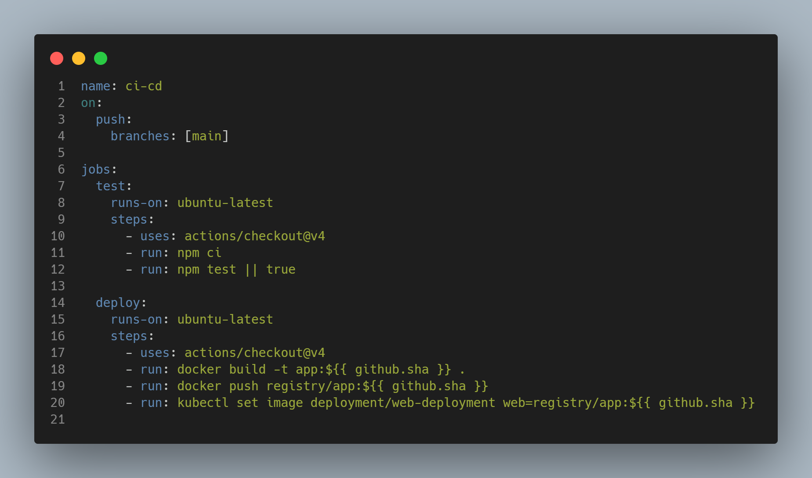

Voy a ir explicando como resolver el examen final de distribuidos paso a paso, vamos a comenzar por comenzar antes del paso 1.
Que seria hechar un primer vistaso a la aplicación.

# Paso 0

## Ejecución de la aplicación localmente

## Realizando un curl a dirección de la aplicación

## Realizando el comando npm test

# Reto#1
Vamos con el primer reto nos dicen que:

## Captura o registro de la aplicación respondiendo manualmente.

## Captura o registro del fallo inicial de la prueba.

## Captura o registro que compare la respuesta real de la aplicación con la expectativa del test.

## Captura o registro del archivo de prueba corregido.

## Captura o registro de npm test ejecutándose correctamente después del ajuste.

# Reto#2

## Captura o registro de la construcción inicial de la imagen.
imagen de docker sin modificar.png>)
## Captura o registro que muestre si el build inicial valida o no las pruebas.
imagen inicial docker sin modifcar nada.png>)
## Captura o registro del Dockerfile final.
 docker corregido.png>)
## Captura o registro de un build bloqueado cuando existe una prueba fallida.
 docker bloqueando la creacion de la imagen.png>)
## Captura o registro de un build exitoso cuando las pruebas pasan.

## Captura o registro del contenedor final respondiendo desde la máquina anfitriona.
 corriendo desde docker pagina.png>)

# Reto#3

## Captura o registro del workflow inicial.

## Captura o registro de una ejecución donde una prueba falla.

## Captura o registro que demuestre el comportamiento defectuoso inicial del pipeline.

## Captura o registro del workflow corregido.

## Captura o registro de una ejecución donde el despliegue se bloquea por una prueba fallida.

## Captura o registro de una ejecución final donde las pruebas pasan y el despliegue continúa.

# Reto#4

